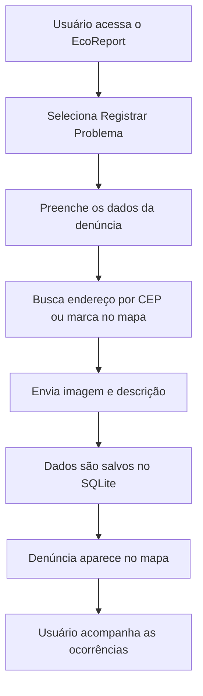

# EcoReport — Plataforma de Denúncia e Monitoramento Ambiental

<p align="center">
  
  
  
  
  
</p>

<p align="center">
  Plataforma web para registro, denúncia e monitoramento de problemas ambientais em mapa interativo.
</p>

---

## Sobre o Projeto

O **EcoReport** é uma aplicação web desenvolvida com **Python, Flask e SQLite**, criada para registrar, armazenar e visualizar denúncias ambientais em um mapa interativo.

A plataforma permite que o usuário informe problemas ambientais, como lixo acumulado, bueiros entupidos, áreas degradadas e esgoto a céu aberto, adicionando endereço, CEP, descrição, coordenadas no mapa e imagem da ocorrência.

O projeto tem como foco facilitar o registro de problemas ambientais em áreas urbanas, contribuindo para a conscientização da população e para o monitoramento de situações que impactam diretamente a qualidade de vida nas cidades.

---

## Objetivo do Projeto

O objetivo do **EcoReport** é facilitar o registro e o acompanhamento de ocorrências ambientais em áreas urbanas.

A plataforma busca auxiliar no monitoramento de problemas ambientais, como descarte irregular de lixo, esgoto a céu aberto e áreas degradadas, tornando as informações mais acessíveis e organizadas.

O projeto também se relaciona com os Objetivos de Desenvolvimento Sustentável:

* **ODS 11 — Cidades e Comunidades Sustentáveis**
* **ODS 13 — Ação Contra a Mudança Global do Clima**

---

## Funcionalidades

* Página inicial com apresentação do projeto.
* Contador de denúncias registradas.
* Cadastro de denúncias ambientais.
* Seleção do tipo de problema ambiental.
* Busca de endereço por CEP usando a API ViaCEP.
* Busca de localização por endereço usando Nominatim/OpenStreetMap.
* Marcação manual da localização diretamente no mapa.
* Armazenamento das denúncias em banco SQLite.
* Upload de imagem da ocorrência.
* Visualização das denúncias em mapa interativo.
* Listagem das denúncias cadastradas em cards.
* Exibição da imagem anexada na denúncia.

---

## Tipos de Problemas Ambientais Monitorados

Atualmente, a plataforma permite registrar os seguintes tipos de ocorrência:

* Lixo acumulado
* Bueiro entupido
* Área degradada
* Esgoto a céu aberto

---

## Tecnologias Utilizadas

| Tecnologia    | Finalidade                           |
| ------------- | ------------------------------------ |
| Python        | Linguagem principal do projeto       |
| Flask         | Framework web utilizado na aplicação |
| SQLite        | Banco de dados local                 |
| HTML5         | Estrutura das páginas                |
| CSS3          | Estilização da interface             |
| JavaScript    | Interações no front-end              |
| Leaflet.js    | Exibição do mapa interativo          |
| OpenStreetMap | Base do mapa                         |
| ViaCEP        | Busca de endereço por CEP            |
| Nominatim     | Busca de localização por endereço    |

---

## Estrutura do Projeto

```text
EcoReport/
│
├── app.py
├── criar_banco.py
├── database.db
├── .gitignore
│
├── static/
│   ├── style.css
│   └── uploads/
│
├── templates/
│   ├── index.html
│   ├── reportar.html
│   └── mapa.html
│
└── docs/
    └── images/
        ├── banner.png
        ├── home.png
        ├── reportar.png
        ├── mapa.png
        └── fluxo.gif
```

---

## Descrição dos Principais Arquivos

### `app.py`

Arquivo principal da aplicação Flask.

Ele contém as rotas responsáveis por:

* Exibir a página inicial.
* Registrar novas denúncias.
* Salvar os dados no banco SQLite.
* Realizar upload de imagens.
* Listar as denúncias cadastradas.
* Renderizar o mapa com os marcadores.

---

### `criar_banco.py`

Script responsável por criar ou atualizar o banco de dados SQLite.

Ele cria a tabela `denuncias`, que armazena as informações das ocorrências ambientais cadastradas na plataforma.

---

### `templates/index.html`

Página inicial do projeto.

Ela apresenta a proposta da plataforma, os tipos de problemas ambientais e o funcionamento básico do sistema.

---

### `templates/reportar.html`

Página de cadastro de denúncias.

Nela o usuário pode informar:

* tipo do problema;
* CEP;
* endereço ou localização;
* descrição;
* imagem da ocorrência;
* latitude;
* longitude.

Também é possível buscar o endereço automaticamente e marcar o ponto diretamente no mapa.

---

### `templates/mapa.html`

Página responsável por exibir as denúncias cadastradas.

As ocorrências aparecem em:

* mapa interativo;
* marcadores;
* cards com informações da denúncia.

---

### `static/style.css`

Arquivo responsável pela estilização da aplicação.

Contém os estilos das páginas, botões, formulários, cards, mapa, cabeçalho, rodapé e demais componentes visuais.

---

### `static/uploads/`

Pasta onde ficam armazenadas as imagens enviadas pelos usuários no momento do cadastro da denúncia.

---

## Banco de Dados

O projeto utiliza o banco **SQLite**, armazenado no arquivo `database.db`.

A tabela principal é chamada `denuncias`.

### Estrutura da tabela `denuncias`

| Campo           | Tipo      | Descrição                       |
| --------------- | --------- | ------------------------------- |
| `id`            | INTEGER   | Identificador único da denúncia |
| `tipo`          | TEXT      | Tipo do problema ambiental      |
| `cep`           | TEXT      | CEP informado pelo usuário      |
| `localizacao`   | TEXT      | Endereço ou local da ocorrência |
| `latitude`      | REAL      | Latitude do ponto marcado       |
| `longitude`     | REAL      | Longitude do ponto marcado      |
| `descricao`     | TEXT      | Descrição da denúncia           |
| `imagem`        | TEXT      | Caminho da imagem enviada       |
| `data_registro` | TIMESTAMP | Data e hora do registro         |

---

## Como Executar o Projeto

### 1. Clone o repositório

```bash
git clone https://github.com/seu-usuario/EcoReport-Plataforma-de-Denuncia-e-Monitoramento-Ambiental.git
```

---

### 2. Acesse a pasta do projeto

```bash
cd EcoReport-Plataforma-de-Denuncia-e-Monitoramento-Ambiental
```

---

### 3. Crie um ambiente virtual

No Windows:

```bash
python -m venv venv
venv\Scripts\activate
```

No Linux ou macOS:

```bash
python3 -m venv venv
source venv/bin/activate
```

---

### 4. Instale as dependências

```bash
pip install flask werkzeug
```

Caso exista um arquivo `requirements.txt`, também é possível instalar usando:

```bash
pip install -r requirements.txt
```

---

### 5. Crie o banco de dados

```bash
python criar_banco.py
```

Se tudo estiver correto, será exibida uma mensagem semelhante a:

```text
Banco criado/atualizado com sucesso!
```

---

### 6. Execute a aplicação

```bash
python app.py
```

---

### 7. Acesse no navegador

Abra o navegador e acesse:

```text
http://127.0.0.1:5000
```

---

## Rotas da Aplicação

| Rota        | Método | Descrição                                 |
| ----------- | ------ | ----------------------------------------- |
| `/`         | GET    | Página inicial do EcoReport               |
| `/reportar` | GET    | Exibe o formulário de denúncia            |
| `/reportar` | POST   | Salva uma nova denúncia no banco          |
| `/mapa`     | GET    | Exibe o mapa com as denúncias registradas |

---

## Como Usar a Plataforma

1. Acesse a página inicial.
2. Clique em **Registrar Problema**.
3. Selecione o tipo de problema ambiental.
4. Informe o CEP ou o endereço.
5. Clique em **Buscar pelo CEP** ou **Buscar pelo endereço**.
6. Confira se o mapa marcou o local corretamente.
7. Caso necessário, clique diretamente no mapa para marcar manualmente.
8. Adicione uma descrição do problema.
9. Anexe uma imagem da ocorrência, caso tenha.
10. Clique em **Enviar denúncia**.
11. Acompanhe a denúncia cadastrada na página do mapa.

---

## Fluxo de Funcionamento



---

## Exemplo de Uso

Um usuário encontra lixo acumulado em uma praça.

Ele acessa o **EcoReport**, seleciona o tipo **Lixo acumulado**, informa o endereço, descreve a situação, adiciona uma foto e envia a denúncia.

Após o envio, a ocorrência aparece no mapa junto com as demais denúncias registradas.

---

## Possíveis Melhorias Futuras

Algumas melhorias que podem ser implementadas futuramente:

* Login e cadastro de usuários.
* Painel administrativo para análise das denúncias.
* Status da denúncia, como:

  * pendente;
  * em análise;
  * resolvida.
* Filtros por tipo de problema ambiental.
* Filtros por data de registro.
* Validação mais detalhada dos campos do formulário.
* Limite de tamanho e tipo dos arquivos enviados.
* Integração com órgãos públicos ou equipes responsáveis.
* Exportação das denúncias em PDF ou Excel.
* Dashboard com indicadores ambientais.
* Histórico de atualizações por denúncia.
* Hospedagem da aplicação em ambiente online.
* Notificação ao usuário sobre atualização da denúncia.
* Priorização de denúncias por gravidade.

---

## Segurança

Como o projeto permite upload de imagens, é importante considerar alguns cuidados em versões futuras:

* Validar o tipo do arquivo enviado.
* Limitar o tamanho máximo da imagem.
* Impedir upload de arquivos executáveis.
* Utilizar nomes seguros para os arquivos.
* Proteger rotas administrativas.
* Evitar exposição de dados sensíveis.
* Utilizar variáveis de ambiente para configurações importantes.

---

## Observações Importantes

* O arquivo `database.db` pode ser gerado localmente ao executar o script `criar_banco.py`.
* A pasta `static/uploads/` é usada para armazenar as imagens enviadas nas denúncias.
* Em um ambiente de produção, é recomendado adicionar validações de segurança para upload de arquivos.
* Também é recomendado configurar variáveis de ambiente para dados sensíveis da aplicação.
* A API ViaCEP é usada para auxiliar na busca de endereço por CEP.
* O mapa utiliza Leaflet.js com base no OpenStreetMap.

---

## Como Adicionar Imagens no README

Para que as imagens apareçam corretamente no GitHub, crie a pasta:

```text
docs/images/
```

Depois coloque seus prints dentro dela com estes nomes:

```text
banner.png
home.png
reportar.png
mapa.png
fluxo.gif
```

Os caminhos usados no README são:

```markdown


```

Caso queira usar outros nomes, basta alterar o caminho da imagem no README.

---

## Contribuição

Contribuições são bem-vindas.

Para contribuir com o projeto:

1. Faça um fork do repositório.
2. Crie uma branch para sua alteração:

```bash
git checkout -b minha-melhoria
```

3. Faça as alterações necessárias.
4. Realize o commit:

```bash
git commit -m "Melhoria no projeto"
```

5. Envie para o repositório remoto:

```bash
git push origin minha-melhoria
```

6. Abra um Pull Request.

---

## Autor

Projeto desenvolvido por **Matheus Soares** para fins acadêmicos e de aprendizado, com foco em sustentabilidade, tecnologia, cidadania e monitoramento ambiental.

---

## Licença

Este projeto é de uso acadêmico e educacional.
